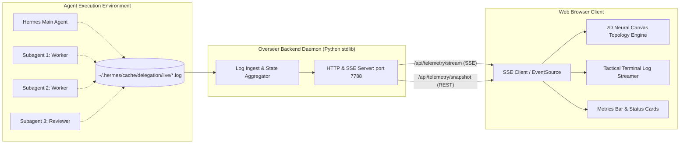
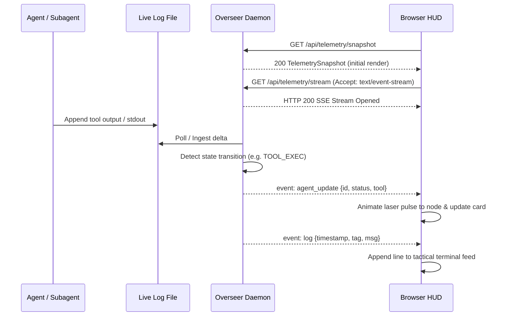
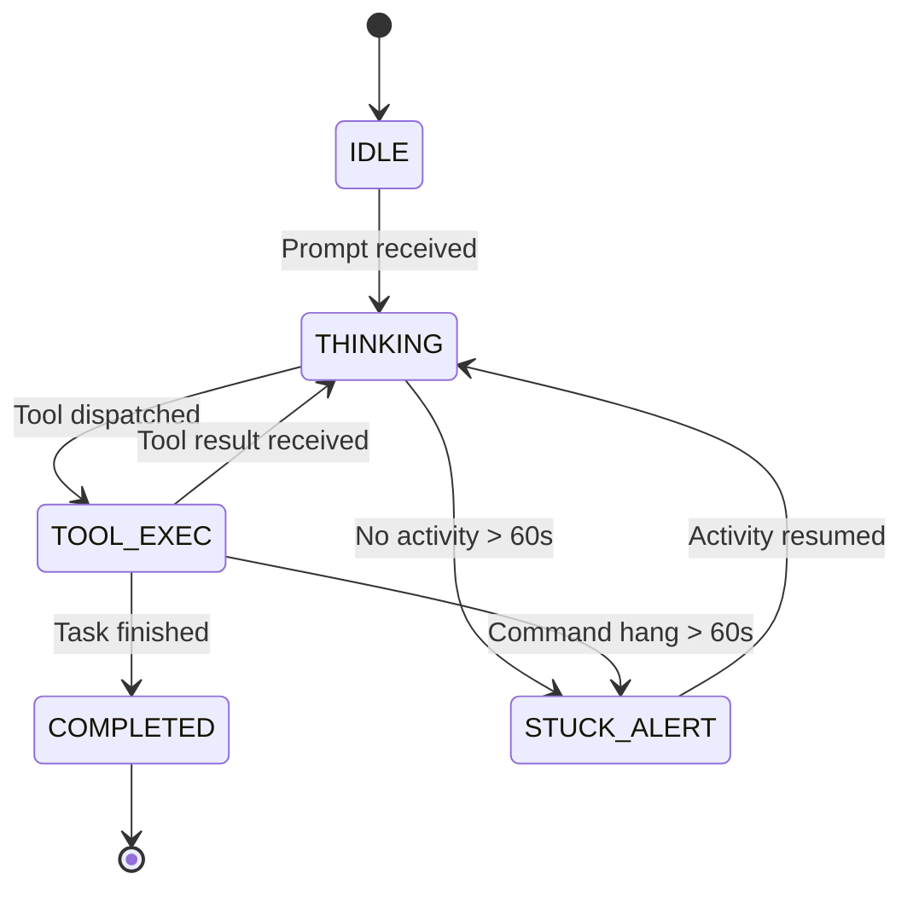

# Diagrams as Code — Overseer (P2.6)

## 1. System Architecture

```mermaid
flowchart LR
    subgraph Execution["Agent Execution Environment"]
        MA[Hermes Main Agent]
        SA1[Subagent 1: Worker]
        SA2[Subagent 2: Worker]
        SAR[Subagent 3: Reviewer]
        LOGS[("~/.hermes/cache/delegation/live/*.log")]
    end

    subgraph Daemon["Overseer Backend Daemon (Python stdlib)"]
        WATCH[Log Ingest & State Aggregator]
        HTTP[HTTP & SSE Server: port 7788]
        WATCH --> HTTP
    end

    subgraph Client["Web Browser Client"]
        SSE[SSE Client / EventSource]
        CANVAS[2D Neural Canvas Topology Engine]
        TERM[Tactical Terminal Log Streamer]
        HUD[Metrics Bar & Status Cards]
        SSE --> CANVAS
        SSE --> TERM
        SSE --> HUD
    end

    MA -.-> LOGS
    SA1 -.-> LOGS
    SA2 -.-> LOGS
    SAR -.-> LOGS
    LOGS --> WATCH
    HTTP -->|"/api/telemetry/stream (SSE)"| SSE
    HTTP -->|"/api/telemetry/snapshot (REST)"| SSE
```

## 2. Telemetry Stream Sequence

```mermaid
sequenceDiagram
    participant AG as Agent / Subagent
    participant FS as Live Log File
    participant DM as Overseer Daemon
    participant UI as Browser HUD

    UI->>DM: GET /api/telemetry/snapshot
    DM-->>UI: 200 TelemetrySnapshot (initial render)
    UI->>DM: GET /api/telemetry/stream (Accept: text/event-stream)
    DM-->>UI: HTTP 200 SSE Stream Opened

    AG->>FS: Append tool output / stdout
    DM->>FS: Poll / Ingest delta
    DM->>DM: Detect state transition (e.g. TOOL_EXEC)
    DM-->>UI: event: agent_update {id, status, tool}
    UI->>UI: Animate laser pulse to node & update card
    DM-->>UI: event: log {timestamp, tag, msg}
    UI->>UI: Append line to tactical terminal feed
```

## 3. Subagent Lifecycle & Stuck Detection

```mermaid
stateDiagram-v2
    [*] --> IDLE
    IDLE --> THINKING : Prompt received
    THINKING --> TOOL_EXEC : Tool dispatched
    TOOL_EXEC --> THINKING : Tool result received
    TOOL_EXEC --> COMPLETED : Task finished
    
    THINKING --> STUCK_ALERT : No activity > 60s
    TOOL_EXEC --> STUCK_ALERT : Command hang > 60s
    STUCK_ALERT --> THINKING : Activity resumed
    
    COMPLETED --> [*]
```
